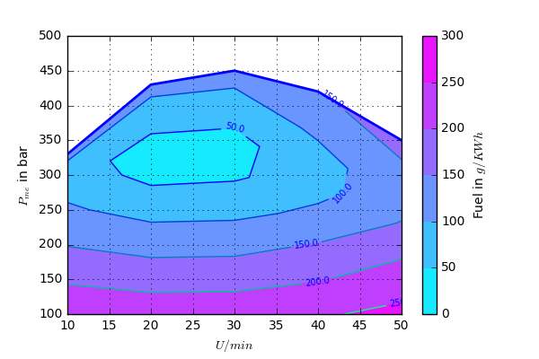

# Motorkennfeldplot / Fuelchart
Plot für ein Motorkennfeld erstellt mit python matplotlib.

Plotting a fuelchart for a combustion engine with python matplotlib.

http://matplotlib.org/api/pyplot_api.html#matplotlib.pyplot.contourf

[Docs for this module here.]( https://motorkennfeldplot.readthedocs.io/en/latest/)

